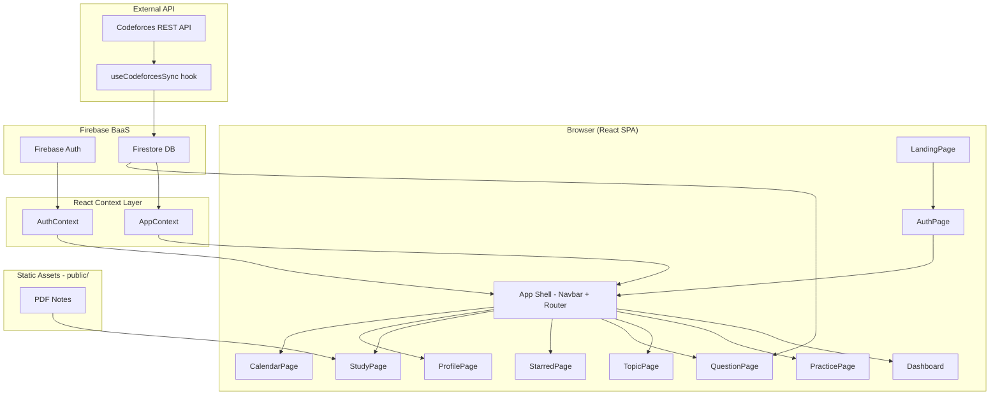
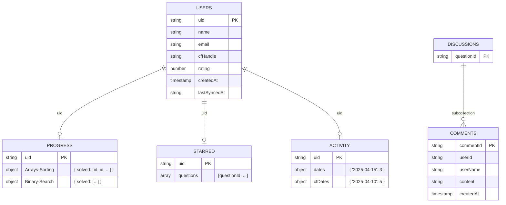
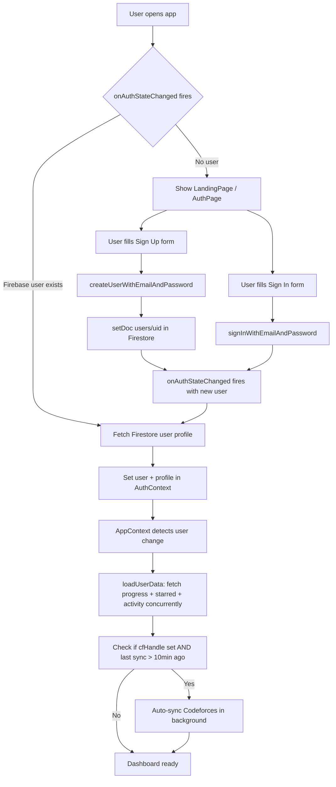
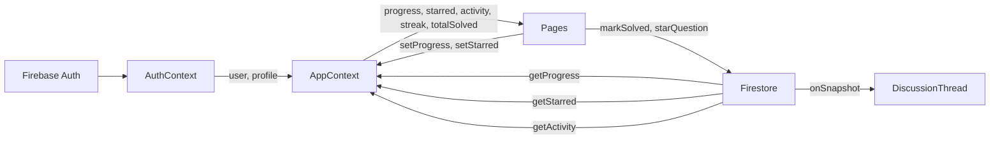
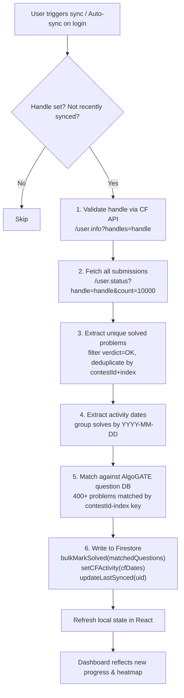
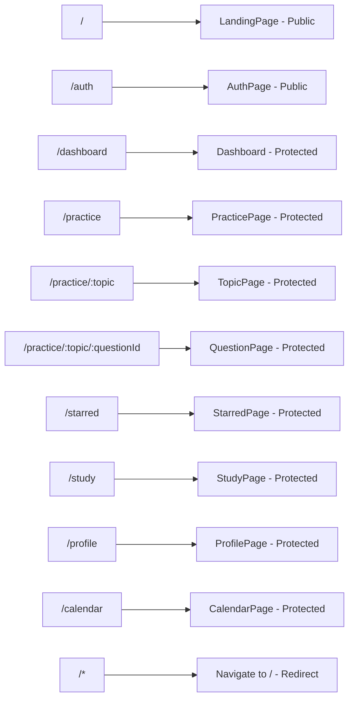
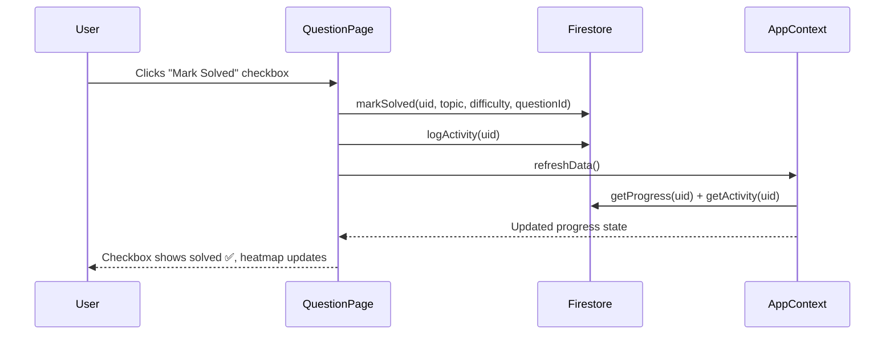
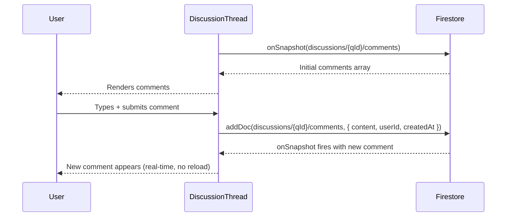
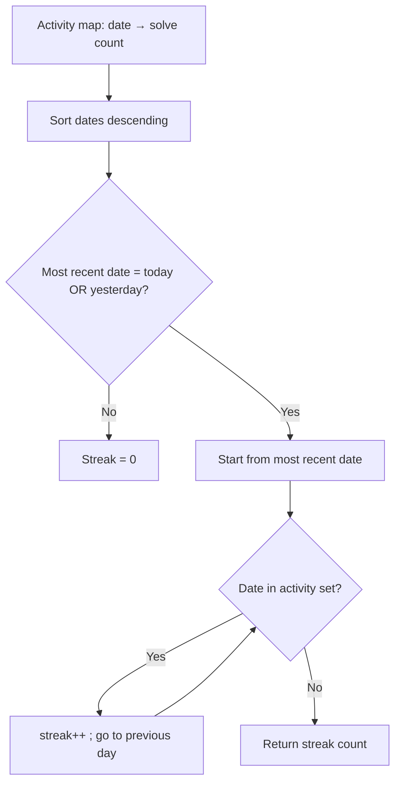

# AlgoGATE — Full Architecture & Concept Document

> A deep-dive into the architecture, React patterns, Firebase integration, workflows, and design decisions behind AlgoGATE.

---

## Table of Contents

1. [Project Vision](#1-project-vision)
2. [High-Level Architecture](#2-high-level-architecture)
3. [Folder Structure & Separation of Concerns](#3-folder-structure--separation-of-concerns)
4. [React Concepts In Depth](#4-react-concepts-in-depth)
5. [Firebase Architecture](#5-firebase-architecture)
6. [Authentication Flow](#6-authentication-flow)
7. [Data & State Management](#7-data--state-management)
8. [Codeforces Sync Pipeline](#8-codeforces-sync-pipeline)
9. [Routing & Protected Routes](#9-routing--protected-routes)
10. [Core Feature Workflows](#10-core-feature-workflows)
11. [Performance Optimizations](#11-performance-optimizations)
12. [Component Tree](#12-component-tree)
13. [Evaluation Checklist Against Rubric](#13-evaluation-checklist-against-rubric)

---

## 1. Project Vision

AlgoGATE solves a real pain point: CP beginners have access to thousands of problems on Codeforces but **no structured learning path, no unified progress tracking, and no way to integrate their existing solving history**.

### What makes it non-trivial?

| Dimension | AlgoGATE's approach |
|---|---|
| **Problem curation** | 400+ hand-picked CF problems organized by topic × difficulty level |
| **Progress intelligence** | CF handle sync auto-maps your Codeforces history into the platform |
| **Unified heatmap** | AlgoGATE solves + Codeforces solves merged into one activity calendar |
| **Real-time community** | Per-problem discussion threads with live `onSnapshot` updates |
| **Study material** | Integrated PDF notes viewer (DSA Java, IITM BS Statistics, Maths, Python) |
| **Advisory system** | Warns before 1300+ questions and recommends mastering easy levels first |

---

## 2. High-Level Architecture



**Key design decision**: The React app is a **fully client-side SPA** deployed on GitHub Pages. Firebase is used purely as a Backend-as-a-Service for auth, database, and real-time listeners — no custom server required.

---

## 3. Folder Structure & Separation of Concerns

```
src/
├── components/          ← Reusable UI components (no business logic)
│   ├── dashboard/       ← Dashboard-specific widgets
│   ├── discussion/      ← Real-time thread UI
│   ├── heatmap/         ← Activity heatmap renderer
│   ├── layout/          ← Navbar, ProtectedRoute (app shell)
│   └── practice/        ← QuestionRow, AdvisoryPopup
│
├── context/             ← Global React state (no UI)
│   ├── AuthContext.jsx  ← Who is logged in? (Firebase Auth listener)
│   └── AppContext.jsx   ← What is their data? (progress, starred, activity)
│
├── hooks/               ← Custom stateful logic
│   └── useCodeforcesSync.js  ← Complete CF API → Firestore pipeline
│
├── pages/               ← Route-level components (compose context + components)
│
├── services/            ← All Firebase/API calls (pure async functions, no React)
│   ├── firebase.js
│   ├── authService.js
│   ├── progressService.js
│   ├── activityService.js
│   ├── discussionService.js
│   └── codeforcesService.js
│
└── utils/               ← Pure business logic (no Firebase, no React)
    ├── questionData.js      ← Master problem database
    ├── progressionEngine.js ← Topic/level progress calculations
    ├── streakEngine.js      ← Streak & heatmap computation
    └── studyData.js         ← Study subjects → topic → PDF mapping
```

**Why this structure works:**
- `services/` never imports from `components/` or `context/` → no circular deps
- `utils/` contains only pure functions → fully unit-testable
- `context/` calls `services/` but components only consume context → data flows one way

---

## 4. React Concepts In Depth

### 4.1 `useState` — Local UI State

Every component that needs local state uses `useState`. Examples:

```jsx
// AuthPage.jsx — form inputs
const [email, setEmail] = useState('');
const [password, setPassword] = useState('');
const [loading, setLoading] = useState(false);
const [error, setError] = useState('');

// QuestionPage.jsx — hint toggle
const [hintVisible, setHintVisible] = useState(false);
const [showAdvisory, setShowAdvisory] = useState(false);

// ProfilePage.jsx — editing state machine
const [editingCF, setEditingCF] = useState(false);
const [saving, setSaving] = useState(false);
const [savedMsg, setSavedMsg] = useState('');
```

### 4.2 `useEffect` — Side Effects

Used for:
- Subscribing to Firebase Auth state changes
- Loading user data when auth changes
- Auto-sync CF on every login (throttled)
- Resetting session guard on logout
- Showing advisory popup once per session

```jsx
// AuthContext.jsx — Firebase auth listener
useEffect(() => {
  const unsubscribe = onAuthStateChanged(auth, async (firebaseUser) => {
    setUser(firebaseUser);
    if (firebaseUser) {
      const p = await getUserProfile(firebaseUser.uid);
      setProfile(p);
    }
    setLoading(false);
  });
  return unsubscribe; // cleanup = unsubscribe
}, []);

// AppContext.jsx — load data when user changes
useEffect(() => {
  loadUserData();
}, [loadUserData]);

// AppContext.jsx — auto-sync CF on login (once per session)
useEffect(() => {
  if (!user || !profile?.cfHandle || autoSyncFiredRef.current) return;
  autoSyncFiredRef.current = true;
  syncIfStale(user.uid, profile.cfHandle, profile.lastSyncedAt)
    .then(result => {
      if (result?.matched > 0) loadUserData();
    });
}, [user, profile, syncIfStale, loadUserData]);
```

### 4.3 `useMemo` — Derived State Memoization

Expensive computations are memoized to only recompute when dependencies change:

```jsx
// Dashboard.jsx — topic progress for all rings
const topicProgresses = useMemo(() =>
  TOPICS.map(t => ({
    topic: t,
    pct: getTopicProgress(progress, t),
    level: getHighestUnlockedLevel(progress, t),
  })),
  [progress]  // Only recomputes when progress changes
);

// AppContext.jsx — aggregate solved count across all topics/levels
const totalSolved = useMemo(() => {
  let count = 0;
  for (const topic of Object.values(progress)) {
    for (const level of Object.values(topic)) {
      count += level?.solved?.length || 0;
    }
  }
  return count;
}, [progress]);

// AppContext.jsx — streak from activity calendar
const streak = useMemo(() => computeStreak(activity), [activity]);
```

### 4.4 `useCallback` — Stable Function References

Prevents child props from changing on every parent render:

```jsx
// AppContext.jsx
const loadUserData = useCallback(async () => {
  if (!user) { setProgress({}); setStarred([]); setActivity({}); return; }
  setDataLoading(true);
  const [p, s, a] = await Promise.all([
    getProgress(user.uid),
    getStarred(user.uid),
    getActivity(user.uid),
  ]);
  setProgress(p || {});
  setStarred(s || []);
  setActivity(a || {});
  setDataLoading(false);
}, [user]); // recreated only when user changes

// useCodeforcesSync.js
const runSync = useCallback(async (userId, handle, options = {}) => {
  // ... full sync logic
}, []); // never recreated
```

### 4.5 `useRef` — Mutable Values Without Re-render

Two critical session guards use `useRef`:

```jsx
// AppContext.jsx — prevents double CF sync per session
const autoSyncFiredRef = useRef(false);

// useCodeforcesSync.js — prevents parallel sync calls
const inProgressRef = useRef(false);

if (inProgressRef.current) return; // already running
inProgressRef.current = true;
try { /* sync */ } finally { inProgressRef.current = false; }
```

`useRef` is chosen over `useState` here because changing these flags should **not** trigger a re-render.

### 4.6 `React.lazy` + `Suspense` — Code Splitting

All 9 page components are lazily loaded:

```jsx
// App.jsx
const LandingPage  = lazy(() => import('./pages/LandingPage'));
const Dashboard    = lazy(() => import('./pages/Dashboard'));
const StudyPage    = lazy(() => import('./pages/StudyPage'));
// ...all 9 pages

// Wrapped in Suspense with brand-consistent loader
<Suspense fallback={<PageLoader />}>
  <Routes>
    <Route path="/" element={<LandingPage />} />
    {/* ... */}
  </Routes>
</Suspense>
```

**Effect**: The initial JS bundle is split into 36 separate chunks. Users only download the code for pages they visit.

### 4.7 Custom Hook — `useCodeforcesSync`

Encapsulates the entire CF sync workflow (6 async steps) with:
- Loading state (`syncing`)
- Result state (`syncResult`)
- Error state (`error`)
- Throttle guard (skips if synced < 10 min ago)
- Race condition guard (`inProgressRef`)
- Two modes: `sync()` (manual, shows UI result) and `syncIfStale()` (silent background)

---

## 5. Firebase Architecture

### Firestore Schema



### Firestore Access Pattern

```
progress/{uid}                    → merged doc with topic keys
starred/{uid}                     → { questions: [...] }
activity/{uid}                    → { dates: {...}, cfDates: {...} }
users/{uid}                       → user profile doc
discussions/{questionId}/comments → subcollection (real-time)
```

### Firebase Services Used

| Service | Purpose |
|---|---|
| `firebase/auth` | Email/password signup, login, signout, `onAuthStateChanged` |
| `firebase/firestore` | `getDoc`, `setDoc`, `updateDoc`, `addDoc`, `deleteDoc`, `arrayUnion`, `arrayRemove`, `onSnapshot`, `serverTimestamp`, `orderBy`, `query`, `collection` |
| `firebase/analytics` | Page view tracking (gracefully skipped in dev) |

---

## 6. Authentication Flow



### ProtectedRoute Logic

```jsx
// components/layout/ProtectedRoute.jsx
export default function ProtectedRoute({ children }) {
  const { user, loading } = useAuth();
  if (loading) return <PageLoader />;
  if (!user) return <Navigate to="/auth" replace />;
  return children;
}
```

When `loading` is true (Firebase still checking session), a spinner is shown instead of redirecting — preventing a flash to the login page for returning users.

---

## 7. Data & State Management

### State Architecture



### Data Loading Strategy

All user data is fetched **concurrently** with `Promise.all` to minimize loading time:

```jsx
const [p, s, a] = await Promise.all([
  getProgress(user.uid),    // Firestore doc
  getStarred(user.uid),     // Firestore doc
  getActivity(user.uid),    // Firestore doc (merged dates)
]);
```

### Optimistic UI Updates

When a user marks a problem solved or stars a question, the UI updates **immediately** (optimistic), then the Firestore write happens in the background:

```jsx
// QuestionPage.jsx — optimistic star toggle
async function toggleStar() {
  if (isStarred) {
    setStarred(s => s.filter(id => id !== question.id)); // ← immediate
    await unstarQuestion(user.uid, question.id);          // ← async write
  } else {
    setStarred(s => [...s, question.id]);                 // ← immediate
    await starQuestion(user.uid, question.id);            // ← async write
  }
}
```

---

## 8. Codeforces Sync Pipeline

This is one of the most complex features — a 6-step async pipeline:



### CF Problem Matching

Each AlgoGATE question stores `contestId` and `index` (e.g., `1234` and `A`). The CF API returns the same fields per submission. The match key is `${contestId}-${index}`:

```js
// codeforcesService.js
const id = `${problem.contestId}-${problem.index}`; // e.g. "1234-A"

// useCodeforcesSync.js
const cfSolvedIds = new Set(cfSolved.map(p => p.id));
for (const question of ALL_QUESTIONS) {
  const cfId = `${question.contestId}-${question.index}`;
  if (cfSolvedIds.has(cfId)) matchedQuestions.push(question);
}
```

### Activity Merging

`activityService.getActivity()` merges AlgoGATE solves (`dates`) and CF solves (`cfDates`) into a single calendar object for the unified heatmap:

```js
const combined = { ...dates };
for (const [d, count] of Object.entries(cfDates)) {
  combined[d] = (combined[d] || 0) + count;
}
return combined;
```

---

## 9. Routing & Protected Routes

### Route Map



### Dynamic Routes

- `/practice/:topic` — `useParams()` gives `topic` → decoded → `getQForTopicLevel(topic, level)`
- `/practice/:topic/:questionId` — `useParams()` gives both → `ALL_QUESTIONS_MAP[questionId]` for O(1) question lookup

---

## 10. Core Feature Workflows

### 10.1 Marking a Problem Solved



### 10.2 Real-Time Discussion Thread



### 10.3 Study Notes Navigation

```mermaid
flowchart TD
    A[User opens /study] --> B[StudyPage renders STUDY_SUBJECTS]
    B --> C{User selects subject tab}
    C --> D["Filters topics for that subject"]
    D --> E{User expands topic accordion}
    E --> F{"Has PDFs?"}
    F -- Yes --> G["Renders PdfCard links\n${BASE_URL}resources/${folderPath}/${file}"]
    F -- No/"Has Agenda" --> H["Renders hanging weekly agenda cards\nwith clickable PDF links"]
    G --> I[Browser opens PDF in new tab]
    H --> I
```

### 10.4 Streak Calculation



---

## 11. Performance Optimizations

| Technique | Where | Why |
|---|---|---|
| `React.lazy` + `Suspense` | `App.jsx` | All 9 pages are code-split → smaller initial bundle |
| `useMemo` | `AppContext`, `Dashboard`, `TopicPage`, `StudyPage` | Avoids recomputing progress/streak/filtered lists on every render |
| `useCallback` | `AppContext`, `useCodeforcesSync` | Stable function refs prevent unnecessary child re-renders |
| `useRef` session guard | `AppContext`, `useCodeforcesSync` | Prevents double auto-sync + parallel sync calls without state overhead |
| `Promise.all` | `AppContext.loadUserData` | Parallel fetching of progress + starred + activity (3× faster than sequential) |
| `onSnapshot` only for discussions | `DiscussionThread` | Real-time listener only where needed; everything else uses one-shot `getDoc` |
| Optimistic UI | `QuestionPage` | Star + solve toggling feels instant |
| CF sync throttle (10 min) | `useCodeforcesSync.syncIfStale` | Avoids expensive CF API calls on rapid re-logins |
| Bulk Firestore write | `bulkMarkSolved` | One `setDoc` per sync (not one per matched question) |
| `ALL_QUESTIONS_MAP` | `questionData.js` | O(1) question lookup by ID (pre-computed Map, not O(n) `.find`) |

---

## 12. Component Tree

```
App
├── AuthProvider (AuthContext)
│   └── AppProvider (AppContext)
│       ├── Navbar
│       └── Suspense
│           └── Routes
│               ├── LandingPage
│               ├── AuthPage
│               └── ProtectedRoute (wraps all below)
│                   ├── Dashboard
│                   │   ├── CFOnboardModal
│                   │   ├── StatsCard × 4
│                   │   ├── ProgressRing × 10 (one per topic)
│                   │   ├── ActivityHeatmap
│                   │   └── CFSyncStatus
│                   ├── PracticePage
│                   ├── TopicPage
│                   │   └── QuestionRow × n
│                   ├── QuestionPage
│                   │   ├── AdvisoryPopup (conditional)
│                   │   └── DiscussionThread
│                   ├── StarredPage
│                   │   └── QuestionRow × n
│                   ├── StudyPage
│                   │   ├── TopicAccordion × n
│                   │   │   └── PdfCard × n
│                   │   └── WeekCard × 7 (IITM Stats agenda)
│                   ├── ProfilePage
│                   └── CalendarPage
```

---

## 13. Evaluation Checklist Against Rubric

### Problem Statement & Idea (15/15)

| Criterion | Status |
|---|---|
| Originality | ✅ Not a clone — completely unique niche (CP learning platform with CF sync) |
| Clarity of problem | ✅ Clearly defined: structured CP learning with progress tracking |
| Real-world relevance | ✅ Used by actual students preparing for placements and competitive exams |

---

### React Fundamentals (20/20)

| Concept | Evidence |
|---|---|
| Functional Components | ✅ All 25+ components are functional |
| Props & Composition | ✅ `StatsCard`, `ProgressRing`, `QuestionRow`, `PdfCard`, `TopicAccordion` |
| `useState` | ✅ Form fields, toggles, loading flags across all pages |
| `useEffect` | ✅ Auth listener, data loading, auto-sync, advisory trigger |
| Conditional Rendering | ✅ Skeletons, solved badge, CF modal, hint panel, advisory popup |
| Lists & Keys | ✅ Topics, questions, heatmap cells, discussion comments — all properly keyed |

---

### Advanced React Usage (15/15)

| Concept | Evidence |
|---|---|
| `useMemo` | ✅ 6+ uses: progress rings, streak, totalSolved, filteredTopics, etc. |
| `useCallback` | ✅ `loadUserData`, `runSync`, `syncIfStale` |
| `useRef` | ✅ `autoSyncFiredRef`, `inProgressRef` |
| `React.lazy` + `Suspense` | ✅ All 9 pages lazy-loaded |
| Custom Hook | ✅ `useCodeforcesSync` |
| Context API | ✅ `AuthContext` + `AppContext` |

---

### Backend Integration (15/15)

| Feature | Evidence |
|---|---|
| Firebase Auth | ✅ Email/password signup + login |
| Protected Routes | ✅ `ProtectedRoute` component guards all 8 app routes |
| Persistent User Data | ✅ Firestore — progress/starred/activity survive refresh + cross-device |
| CRUD — Create | ✅ signup, postComment, markSolved, starQuestion |
| CRUD — Read | ✅ getProgress, getStarred, getActivity, getDiscussions |
| CRUD — Update | ✅ bulkMarkSolved, updateCFHandle, updateUserRating, logActivity, setCFActivity |
| CRUD — Delete | ✅ markUnsolved, unstarQuestion, deleteComment |

---

### UI/UX (10/10)

| Feature | Evidence |
|---|---|
| Responsive design | ✅ Tailwind responsive grid (sm/md/lg breakpoints throughout) |
| Consistent design system | ✅ Custom CSS tokens (brand colors, glass morphism, dark mode) |
| Loading states | ✅ Skeleton cards, spinner in Suspense fallback, per-button loading |
| Error handling | ✅ Auth errors, sync errors, 404 question fallbacks |
| Smooth UX | ✅ Lazy loading, optimistic updates, animated transitions |

---

### Code Quality (10/10)

| Feature | Evidence |
|---|---|
| Proper folder structure | ✅ `/components`, `/pages`, `/hooks`, `/context`, `/services`, `/utils` |
| Reusable components | ✅ `StatsCard`, `ProgressRing`, `QuestionRow`, `PdfCard` |
| Separation of concerns | ✅ Services have no React; utils have no Firebase |
| Clean code | ✅ Consistent naming, comments, no dead code |
| No unnecessary re-renders | ✅ `useMemo`, `useCallback`, `useRef` used strategically |

---

### Functionality (10/10)

All features complete and working on live deployment:
- Authentication ✅
- Dashboard with live stats ✅
- Topic × difficulty practice system ✅
- Mark solved / unsolved ✅
- Star / unstar questions ✅
- Discussion threads (real-time) ✅
- Codeforces auto-sync ✅
- Activity heatmap ✅
- Study notes PDF browser ✅
- Profile management ✅

---

*Built by students, for students. AlgoGATE is the CP platform we wished existed when we started.*
